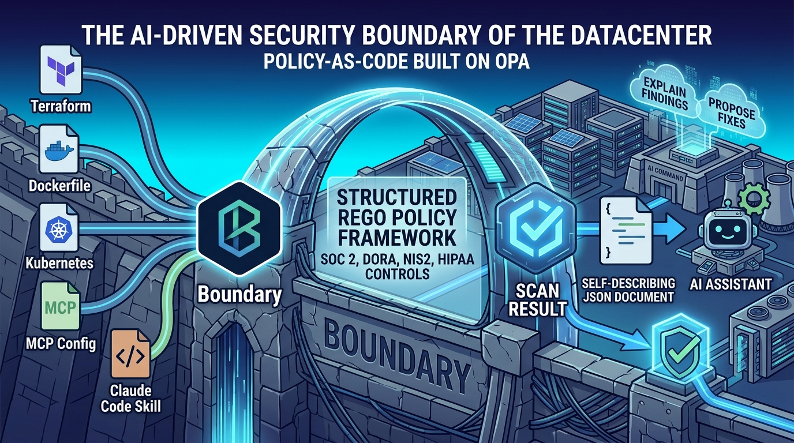

<p align="center">
  
</p>

# Boundary

<p align="center">
  
  
  
  
  
  
  
</p>

**AI-first policy-as-code security scanner built on [Open Policy Agent](https://www.openpolicyagent.org/).**

Boundary scans infrastructure and agent definitions — Terraform, Dockerfiles,
Kubernetes manifests, MCP server configs, and Claude Code skills — against a
structured Rego policy framework mapped to SOC 2, DORA, NIS2, and HIPAA
controls. The scan result is a self-describing JSON document designed to be
handed to an AI assistant, which explains findings in plain language and
proposes concrete fixes.

Design philosophy: **the CLI is a thin, deterministic, no-agent tool; the AI
harness (e.g. Claude Code) is the agent.** All assessment logic lives in
annotated Rego policies; all analysis and remediation authoring happens in
the AI layer reading the scan output.

## Install

```bash
# prerequisites: python >= 3.14 and the opa binary
curl -sSL -o ~/.local/bin/opa \
  https://openpolicyagent.org/downloads/latest/opa_linux_amd64_static && chmod +x ~/.local/bin/opa

git clone https://github.com/andrewblooman/boundary && cd boundary
python3.14 -m venv .venv && .venv/bin/pip install -e ".[dev]"
```

> Boundary resolves its built-in policies from the repo checkout. For
> non-editable installs, point `BOUNDARY_POLICY_ROOT` at a `policies/`
> directory (or pass `--policy-dir`).

## Use

```bash
boundary scan .                          # scan everything, table output
boundary scan infra/ --target terraform  # one target kind
boundary scan . --format json -o boundary.json --fail-on NEVER   # for AI analysis
boundary scan . --format sarif -o results.sarif                  # GitHub Code Scanning
boundary policies --compliance soc2      # list policies by framework
boundary explain BND-TF-001              # full metadata for one rule
```

Exit codes: `0` clean (or below `--fail-on` threshold), `1` findings at/above
threshold, `2` error. Default threshold is `LOW`.

For accurate Terraform results, scan a resolved plan:

```bash
terraform plan -out plan.out && terraform show -json plan.out > plan.json
boundary scan plan.json
```

Raw `.tf` scanning works too (credential-free, pre-commit friendly) but sees
unresolved expressions.

## GitHub Actions

```yaml
jobs:
  boundary:
    runs-on: ubuntu-latest
    permissions:
      contents: read
      security-events: write   # for SARIF upload
      pull-requests: write     # for the PR summary comment
    steps:
      - uses: actions/checkout@v4
      - uses: andrewblooman/boundary/action@main
        with:
          path: .
          fail-on: HIGH        # gate the job on findings
```

Findings appear three ways: as **PR annotations** (via Code Scanning, from the
SARIF upload), as a **summary comment on the PR** (kept updated in place on
each push — set `comment-on-pr: "false"` to disable), and in the **job
summary**. The comment requires `pull-requests: write` and only works for
PRs from the same repository — `GITHUB_TOKEN` is read-only on fork PRs by
GitHub's design, so a fork-accepting public repo would need a GitHub App (or
`pull_request_target` handled carefully) instead.

By default the comment posts as `github-actions[bot]` (the job's
`GITHUB_TOKEN`). For a distinct bot identity, mint a GitHub App installation
token and pass it via `github-token`:

```yaml
      - uses: actions/create-github-app-token@v3
        id: app-token
        with:
          app-id: ${{ secrets.BOUNDARY_APP_ID }}
          private-key: ${{ secrets.BOUNDARY_APP_PRIVATE_KEY }}
      - uses: andrewblooman/boundary/action@main
        with:
          path: .
          github-token: ${{ steps.app-token.outputs.token }}
```

## Claude Code integration

Symlink the bundled skill and ask Claude to scan:

```bash
ln -s "$(pwd)/skills/boundary" ~/.claude/skills/boundary
```

Then in Claude Code: */use the boundary skill to scan this repo and fix the
criticals*. The skill runs the scanner, reads `boundary.json` (whose
`ai_context` block documents how an AI should consume it), explains each
finding, proposes diffs driven by each finding's `fix_hint` and
`remediation`, and re-scans after fixing.

## Policy framework

55 built-in policies across five packs:

| Pack | IDs | Examples |
|---|---|---|
| `terraform` | `BND-TF-0xx` | unencrypted S3/EBS/RDS, public ACLs, `0.0.0.0/0` ingress, IAM `*`/`*`, hardcoded secrets |
| `docker` | `BND-DK-0xx` | root user, unpinned base images, secrets in ENV/ARG, `curl \| sh` |
| `kubernetes` | `BND-K8-0xx` | privileged pods, host namespaces, hostPath, missing limits, literal env secrets |
| `mcp` | `BND-MCP-0xx` | secrets in server env, http:// transports, unpinned `npx -y` packages, filesystem servers rooted at `/` — any `.json` file with an `mcpServers` key is detected by content, not filename, so e.g. Claude Code's own `~/.claude.json` is picked up too |
| `skills` | `BND-SK-0xx` | instruction-hijacking phrasing, credential-store access, obfuscated payloads, exfiltrating scripts |

Every policy is one Rego file whose `# METADATA` block carries its id,
severity, SOC 2/DORA/NIS2/HIPAA mappings, remediation text, and a
machine-readable `fix_hint` — the single source of truth that flows into
every output format. To add a policy, add one file:
see [docs/POLICY_AUTHORING.md](docs/POLICY_AUTHORING.md).

## Output formats

- `json` — canonical [schema](schemas/boundary-result.schema.json); findings are
  self-contained (severity, location, observed value, remediation, compliance
  controls) with an `ai_context` block telling an LLM how to consume the file
- `sarif` — SARIF 2.1.0 with `security-severity` and per-control tags
- `md` — summary for `$GITHUB_STEP_SUMMARY` or docs
- `table` — terminal output (default)

## Development

```bash
opa test policies/ tests/policies/     # 92 policy tests
pytest -q                              # adapters, engine, reporters
regal lint policies/ tests/policies/   # Rego style
ruff check boundary/ tests/python/     # Python style
```

CI runs all of the above plus a dogfood job that scans `fixtures/` with the
published action and asserts the seeded findings are still caught.
